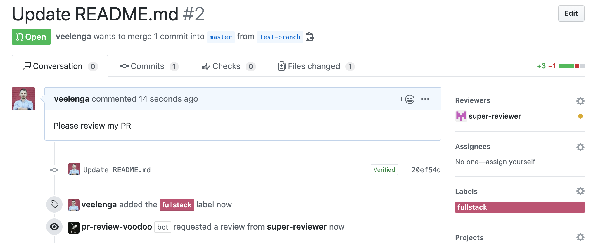

# GitHub PR Review Voodoo

[](https://travis-ci.org/veelenga/gh-pr-review-voodoo)

A GitHub bot to improve PR review workflow. It is able to:

- [x] request PR reviews based on selected labels
- [x] assign PR to requester



## Setup

```sh
# Install dependencies
npm install

# Run the bot
npm run dev
```

## Config

```yml
# .github/pr-review-voodoo.yml

# Reviews will be requested from desired people once PR is labeled.

reviewerGroupsByLabels:
  front-end:            # label name
    - reviewer1         # user github login
    - reviewer2
    - reviewer3

  back-end:
    - reviewer4
    - reviewer5

  fullstack:
    - reviewer3
    - reviewer4

autoAssignToRequestor: true # auto assign opened pull request to requestor (false by default)
minAmountOfReviewers: 2     # a minimum amount of reviewers to be added to PR

```

## Deployment

```
$ now deploy
```

Refer to [Deploying Probot Apps on Now v2](https://medium.com/twostoryrobot/deploying-probot-apps-on-now-v2-b457650dadde) for more info.

## Testing

```
$ npm run test
```

## Contributing

If you have suggestions for how gh-pr-review-voodoo could be improved, or want to report a bug, open an issue! We'd love all and any contributions.

For more, check out the [Contributing Guide](CONTRIBUTING.md).

## License

[ISC](LICENSE) © 2019 Vitalii Elenhaupt <velenhaupt@gmail.com>
